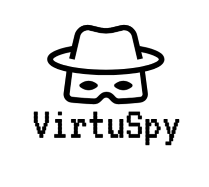

# VirtuSpy
<div align="center">
  
</div>

   


VirtuSpy is a cutting-edge tool designed to detect and analyze virtualized environments, including virtual machines (VMs) and sandbox setups, with exceptional precision. By leveraging advanced detection techniques, VirtuSpy uncovers subtle traces left by virtualization platforms, commonly used in security testing and software analysis.

The tool performs comprehensive checks on key system components like file structures, memory configurations, processes, MAC addresses, and registry keys, delivering accurate insights for cybersecurity professionals and analysts.

Whether for penetration testing, forensic analysis, or system verification, VirtuSpy provides a user-friendly, efficient, and flexible solution to detect virtualized environments across various platforms.
## Key Features

- **Comprehensive Virtualization Detection**  
  Scans system components like file system, memory, processes, and registry keys for virtualization indicators.

- **Multiple Detection Techniques**  
  Uses methods such as memory checks, file analysis, and process monitoring for accurate results.

- **Windows-Specific Checks**  
  Includes registry and activation status checks for Windows environments.

- **Flexible and Modular**  
  Customizable checks for different platforms and scenarios.

- **Cross-Platform Compatibility**  
  Works on Windows, Linux, and macOS.

- **Intuitive Interface**  
  User-friendly interface with clear results and detailed reports.

- **Reliable and Efficient**  
  Fast and accurate detection with minimal system overhead.

## Installation Instructions

### Prerequisites

Before you can install VirtuSpy, make sure you have the following tools:

- **Python 3.6 or higher**: Ensure Python is installed on your system. You can check your Python version with the following command:

  ```bash
  python --version
  ```
  If Python is not installed, you can download it from the official website. <a href="https://www.python.org/downloads/">Download Python</a>
  
- **pip** should also be installed. To check if you have `pip`, run the following command in your terminal:

  ```bash
  pip --version
  ```
  If pip is not installed, you can download it from the official website. <a href="https://pip.pypa.io/en/stable/installation">Download pip</a>
### Step 1: Clone the Repository
First, clone the VirtuSpy repository to your machine using Git:

```bash
git clone https://github.com/Adamzayene/VirtuSpy.git
```
### Step 2: Navigate to the Project Directory
After cloning the repository, navigate to the directory containing the code:

```bash
cd VirtuSpy
```
### Step 3: Install Dependencies
To install all required packages for running VirtuSpy, use the following command:

```bash
pip install -r requirements.txt
```
### Step 4: Run VirtuSpy
After installing the required dependencies, you can run VirtuSpy using Python:

```bash
python3 main.py
```
## Contributing

We welcome contributions to VirtuSpy from the community! Whether you're reporting bugs, proposing new features, or enhancing existing functionality, your involvement is invaluable. Please feel free to open an issue for discussion or submit a pull request with your proposed changes. All contributions, regardless of size, are highly appreciated and contribute to the project's growth and success.
